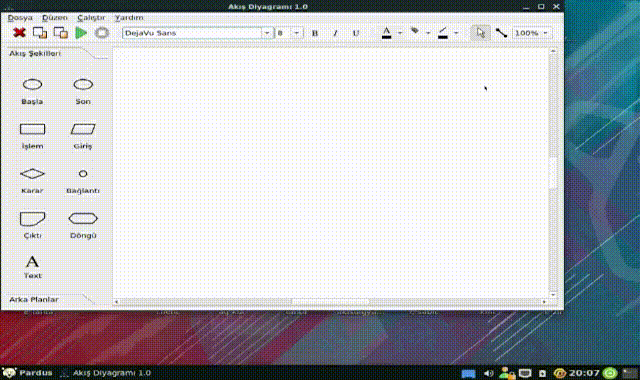

# Akış Diyagramı
 Kodlama için Flowchart Yazılımına Alternatif Yazılım.
 

Uygulama Qt ortamında c++ ile yazılmıştır..
 Qt 5.11.2 versiyonu ile yazılmıştır.
 gcc 4.9 versiyon kullanılmıştır..,
 Derlemek için kodu indiriniz.. kod adında bir dizinde açtığınızı varsayalım
 1-cd kod
 2-mkdir build
 3-cd build
 4-qmake ../akisdiyagram.pro
 5-make&make clean
 6-make install
 Bu işlemleri hatasız yaparsanız uygulama derlenecek ve sisteme yüklenecektir..
